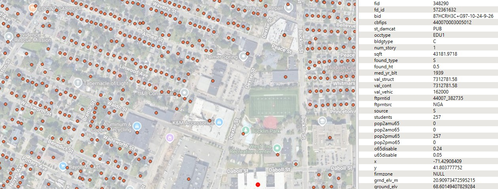

# Building Inventories Technical Implementation

The **Consequence Modeling Solution** is designed to natively ingest the **National Structures Inventory (NSI)** and the **Milliman Market Basket** datasets out of the box, while also providing a pathway for users to integrate their own **custom inventory data**. **Table 1** identifies the supported data sources, versions, expected input formats, and applicable consequence-modeling pathways.

**Table 1. Supported Inventory Data Sources**

| **Data Source**              | **Version**                | **Input File Type** | **Consequence Modeling** |
| ---------------------------- | -------------------------- | ------------------- | ------------------------ |
| **NSI**                      | 2022 Public Version        | GeoPackage          | Inland, Coastal          |
| **NSI**                      | 2022 FEMA-Enhanced Version | File Geodatabase    | Inland only              |
| **Milliman Market Baskets**  | 2021 Uniform, Uncorrelated | File Geodatabase    | Inland, Coastal          |
| **User-defined Inventories** | User-defined               | User-defined        | Inland, Coastal          |

For additional details on inventory requirements and methodology, refer to the **[Inventory Methodology Documentation](inventory_methodology.md)**.

______________________________________________________________________

## Inventory Ingestion and Processing Approach

Regardless of which inventory type is provided, several **required fields** must be present to support loss calculations. However, the **Consequence Solution** is designed to minimize the amount of data preprocessing required from the user by implementing the following strategies:

- **Auto-detection** of required fields based on common naming conventions
- **Auto-population** of missing fields using documented default values
- **User-provided overrides** for NSI and Milliman field names
- **Comprehensive documentation** for each inventory source, including requirements for user-defined datasets
- **Schema validation** to ensure completeness and correctness prior to modeling

______________________________________________________________________

## Base Buildings Class

> *TODO:* Define the **Base Buildings Schema** used for consequence analysis in both inland and coastal applications. All `target_fields` referenced in subsequent sections should be defined here.

______________________________________________________________________

## National Structures Inventory (NSI)



The **National Structures Inventory (NSI)**, developed by the **U.S. Army Corps of Engineers (USACE)**, is a nationwide database of structures across the 50 U.S. states. At present, the NSI does not include coverage for U.S. territories. The publicly available NSI dataset provided many of the key fields used for consequence analysis; however, it is important to note that **building** and **contents values** are reported as **depreciated values** rather than full replacement costs. Full technical documentation for the NSI is available on the [**USACE NSI Technical Documentation page**](https://www.hec.usace.army.mil/confluence/nsi/technicalreferences/latest/technical-documentation).

USACE also maintains a **restricted version** of the NSI accessible to federal users, which contains additional attributes derived from parcel data and other proprietary sources.

To support national hazard risk assessments, **FEMA** has developed an **enhanced internal version** of the NSI that extends coverage to the **District of Columbia**, **Puerto Rico**, the **U.S. Virgin Islands**, and **Pacific Territories**. This FEMA-enhanced dataset applies **full replacement values** consistent with the *Hazus 7.0 Inventory Technical Manual* and resolves several known data quality issues identified in the public NSI.

### NSI 2022 Public Version

The **2022 Public NSI** contains all attributes required to support both **inland** and **coastal** consequence modeling. **Table 2** lists the key fields used in the Consequence Modeling Solution, including data types, assumptions, rules, and default values assigned when data is missing.

**Table 2. NSI 2022 Public Data Attributes for Analysis**

| **Analysis Attribute**    | **Data Type** | **NSI Field Name** | **Consequence Modeling** | **Assumption**                    | **Rule**                                | **Default if Missing**                                     |
| ------------------------- | ------------- | ------------------ | ------------------------ | --------------------------------- | --------------------------------------- | ---------------------------------------------------------- |
| **Geometry**              | Point         | Shape              | Inland, Coastal          | Point geometry                    | Must be valid point geometry            | **Error (required)**                                       |
| **Unique ID**             | Object ID     | fid                | Inland, Coastal          | Provided                          | Must be present and unique              | **Error (required)**                                       |
| **Occupancy Type**        | String        | occtype            | Inland, Coastal          | Provided; must map to Hazus types | Must map to Hazus types                 | **RES1**                                                   |
| **Building Value**        | Numeric       | val_struct         | Inland, Coastal          | Depreciated USD value             | Must be present                         | **Error (required)**                                       |
| **Content Value**         | Numeric       | val_cont           | Inland, Coastal          | Depreciated USD value             | Validate > 0; assign default if missing | Default % by occupancy (see Inventory Methodology Table 3) |
| **Number of Stories**     | Numeric       | num_story          | Inland, Coastal          | Provided                          | Validate > 0; assign default            | **1**                                                      |
| **Area / Square Footage** | Numeric       | sqft               | Inland                   | Square footage                    | Validate > 0; assign default            | Hazus defaults (Inventory Methodology Table 2)             |
| **General Building Type** | String        | bldgtype           | Inland                   | Provided (M, W, H, S)             | Assign default if missing               | **W (Wood)**                                               |
| **Foundation Type**       | String        | found_type         | Inland, Coastal          | Provided (C, B, S, P, I, F, W)    | Assign default if missing               | **Slab**                                                   |
| **Foundation Height**     | Numeric       | found_ht           | Inland, Coastal          | Feet above ground                 | Assign default                          | Slab = 1 ft; Shallow = 3 ft; Pile = 8 ft; Basement = 2 ft  |
| **Ground Elevation**      | Numeric       | Ground_elv         | Coastal                  | Feet (NAVD88)                     | Required for coastal modeling           | **Error (required)**                                       |

#### NSI 2022 Public – Inland Foundation Type Mapping

For the NSI Public dataset, the `found_type` field must be mapped to the **standardized inland foundation types** used by the Consequence Modeling engine.

**Implementation Rules:**

- The NSI `found_type` field is **always** used as the source field.
- Foundation types must be translated using **Table 3**.
- If a code does **not** match a supported value:
  - Treat the foundation type as **uncertain**, and
  - Assign the default inland foundation type **SLAB**.
- No parcel-derived refinements are available in the public NSI.

**Table 3. Inland Foundation Type Mapping for NSI 2022 Public Version**

| **found_type** | **Description** | **Assigned Inland Foundation Type** |
| -------------- | --------------- | ----------------------------------- |
| C              | Crawl           | SHAL                                |
| B              | Basement        | BASE                                |
| S              | Slab            | SLAB                                |
| P              | Pier            | SHAL                                |
| F              | Fill            | SLAB                                |
| W              | Solid Wall      | SHAL                                |
| I              | Pile            | PILE                                |

#### NSI 2022 Public – Coastal Foundation Type Mapping

> *TODO:* Define coastal foundation type mapping rules for the NSI Public dataset.

______________________________________________________________________

### NSI 2022 FEMA-Enhanced Version

The **NSI 2022 FEMA-Enhanced Version** allows users to calculate losses using **full replacement costs** and expands structure coverage to include Washington, D.C., Puerto Rico, U.S. Virgin Islands. This enhanced version also includes **parcel-derived fields** that support refinement of the **inland foundation type** assignment.

However, the FEMA-enhanced dataset does **not** include ground-elevation information. As a result, only **inland consequence modeling** is supported out of the box.
Users may preprocess the dataset and manually supply ground elevations if they wish to perform coastal modeling using the **user-defined inventory ingestion process**. **Table 4** summarizes the attributes used in the analysis, including data types, assumptions, rules, and defaults applied when values are missing.

**Table 4. NSI 2022 FEMA-Enhanced Data Attributes for Analysis**

| **Analysis Attribute**       | **Data Type** | **NSI Field Name**    | **Assumption**                              | **Rule**                                    | **Default if Missing**                                    |
| ---------------------------- | ------------- | --------------------- | ------------------------------------------- | ------------------------------------------- | --------------------------------------------------------- |
| **Geometry**                 | Point         | Shape                 | Point geometry                              | Must be valid point geometry                | **Error (required)**                                      |
| **Unique ID**                | Object ID     | OBJECTID              | Provided                                    | Must be present and unique                  | **Error (required)**                                      |
| **Occupancy Type**           | String        | OCCTYPE               | Provided; must map to Hazus occupancy types | Must map to Hazus types                     | **RES1**                                                  |
| **Building Value**           | Numeric       | Hazus_Building_Values | Full replacement cost (USD)                 | Must be present                             | **Error (required)**                                      |
| **Content Value**            | Numeric       | Hazus_Content_Values  | Full replacement cost (USD)                 | Validate > 0; assign default if missing     | Default % by occupancy (Inventory Methodology Table 3)    |
| **Number of Stories**        | Numeric       | NUM_STORY             | Provided                                    | Validate > 0; assign default                | **1**                                                     |
| **Area / Square Footage**    | Numeric       | SQFT                  | Square footage (sq ft)                      | Validate > 0; assign default                | Hazus defaults (Inventory Methodology Table 2)            |
| **General Building Type**    | String        | GENERALBUILDINGTYPE   | Provided (M, W, H, S)                       | Assign default if missing                   | **W (Wood)**                                              |
| **Foundation Type**          | String        | FNDTYPE               | Provided (C, B, S, P, I, F, W)              | Assign default if missing                   | **Slab**                                                  |
| **Foundation Height**        | Numeric       | FOUND_HT              | Feet above ground elevation                 | Assign default if missing                   | Slab = 1 ft; Shallow = 3 ft; Pile = 8 ft; Basement = 2 ft |
| **Foundation Type (Parcel)** | String        | P_FNDTYPE             | Provided                                    | Used only for parcel-based refinement logic | None                                                      |
| **Basement Type (Parcel)**   | String        | P_BSMNT               | Provided                                    | Used only for parcel-based refinement logic | None                                                      |

#### NSI 2022 FEMA-Enhanced — Inland Foundation Type Mapping

For the FEMA-Enhanced NSI, parcel-derived fields (`P_FNDTYPE` and `P_BSMNT`) are used to refine the inland foundation type. The following rules determine the **assigned inland foundation type**:

**Refinement Rules:**

- If `P_BSMNT` contains any of the following codes — `B`, `U`, `I`, `F`, `P`, `L`, `D`, `Y` — set inland foundation type to **BASE**.

- If `P_FNDTYPE` contains any of the following codes — `S`, `P`, `L`, `F`, `E`, `T`, `W`, `A` — inland foundation type must stay **blank/null**, even when `P_BSMNT` indicates a basement.

- If `P_BSMNT` does not indicate a basement, inland foundation type comes directly from `P_FNDTYPE` using the mapping in **Table 5**.

- If `P_FNDTYPE` is null, use the NSI-provided `FNDTYPE` field and map it using the same rules as the **NSI 2022 Public Version** (`found_type`). *`FNDTYPE` in FEMA-Enhanced is equivalent to `found_type` in the Public NSI.*

**Table 5. NSI 2022 FEMA-Enhanced Parcel Foundation Type Mapping**

| **P_FNDTYPE** | **Description** | **Assigned Inland Foundation Type**                            |
| ------------- | --------------- | -------------------------------------------------------------- |
| P             | Piers           | SHAL                                                           |
| A             | Concrete        | SLAB                                                           |
| W             | Wood            | SHAL                                                           |
| C             | Crossed Walls   | SLAB                                                           |
| S             | Slab            | SLAB                                                           |
| K             | Concrete Block  | SHAL                                                           |
| O             | Other           | NULL                                                           |
| G             | Stone           | SHAL                                                           |
| D             | Masonry         | SHAL                                                           |
| L             | Piling          | PILE                                                           |
| R             | Retaining Wall  | SHAL                                                           |
| T             | Footing         | SLAB                                                           |
| B             | Crawl / Raised  | SHAL                                                           |
| F             | Mud Sill        | SLAB                                                           |
| E             | Earth           | SLAB                                                           |
| Z             | Placeholder     | If `P_BSMNT` indicates basement → **BASE**, otherwise **Slab** |

______________________________________________________________________

## Milliman Market Baskets Data


The **Milliman Market Baskets** were developed by **Milliman, Inc.** to support **FEMA’s Risk Rating 2.0 initiative**. Milliman created Market Baskets for all U.S. states and territories to provide a representative sample of **single-family homes (RES1)** used in the development of rating factors. Market Basket locations were derived primarily from **CoreLogic ParcelPoint** data, supplemented with **U.S. Census** and **National Hydrography Dataset (NHD)** information, and refined through **extensive quality control** to ensure accuracy and realistic spatial distribution.

Three categories of data, referred to as **“books”**, were created from the Market Baskets:

1. **Uniform Book** – Each property assigned identical structural and coverage characteristics, allowing geographic variability to be analyzed independently.
1. **Uncorrelated Market Basket** – Contains randomized property and policy characteristics not correlated with geography; *foundation type* and *first-floor height* remain linked to prevent implausible combinations.
1. **Correlated Market Basket (Inforce Dataset)** – Joined with FEMA policy data (GFE access required); attributes are correlated to reflect realistic joint distributions and align with observed **parcel** and **NFIP exposure** data.

The Consequences Solution is designed and tested using the Uniform and Uncorrelated Market Basket datasets. **Table 6** describes the analysis attributes used across these books. Although the schema is consistent, the method of attribute imputation varies by dataset. For example, the Uncorrelated Market Basket randomizes property and coverage characteristics, while the Correlated Market Basket applies state-specific distributions to more closely represent actual conditions.

The Milliman Market Basket datasets support both coastal and inland loss calculations, as they include the necessary structural, coverage, and geographic attributes for each modeling environment. Their use, however, is limited to single-family residential (RES1) structures, as the datasets were specifically developed for rating factor development under FEMA’s NFIP framework. For more details, refer to the [**FEMA (2022)**](https://www.fema.gov/sites/default/files/documents/FEMA_Risk-Rating-2.0_Methodology-and-Data-Appendix__01-22.pdf).

**Table 6. Milliman Data Attributes for Analysis**

| **Analysis Attribute**            | **Data Type** | **Milliman Field Name** | **Assumption**                       | **Rule**                            | **Default if Missing**                                 |
| --------------------------------- | ------------- | ----------------------- | ------------------------------------ | ----------------------------------- | ------------------------------------------------------ |
| **Geometry**                      | Point         | Shape                   | Point geometry                       | Must be valid point geometry        | **Error (required)**                                   |
| **Unique ID**                     | Object ID     | Location                | Provided                             | Must be present and unique          | **Error (required)**                                   |
| **Occupancy Type**                | String        | *Not provided*          | Assume RES1                          | Assign default                      | **RES1**                                               |
| **Building Value**                | Numeric       | BLDG_VALUE              | Full replacement cost (USD)          | Must be present                     | **Error (required)**                                   |
| **Content Value**                 | Numeric       | CNT_VALUE               | Full replacement cost (USD)          | Validate > 0; assign default        | Default % by occupancy (Inventory Methodology Table 3) |
| **Number of Stories**             | Numeric       | NUM_STORIE              | Provided                             | Validate > 0; assign default        | **1**                                                  |
| **Area / Square Footage**         | Numeric       | *Not provided*          | Assume 1,800 sq ft                   | Assign default                      | Hazus RES1 default = **1,800 sq ft**                   |
| **General Building Type**         | String        | *Not provided*          | Assume Wood                          | Assign default                      | **W (Wood)**                                           |
| **Foundation Type**               | Numeric       | foundation              | Milliman codes: 2, 4, 6, 7, 8, 9     | Should be populated; assign default | **Slab**                                               |
| **Foundation Height**             | Numeric       | FIRST_FLOO              | First-floor height above ground (ft) | Should be populated; assign default | Slab 1 ft; Shallow 3 ft; Pile 8 ft; Basement 2 ft      |
| **Ground Elevation**              | Numeric       | DEMft                   | DEM ground elevation (ft, NAVD88)    | Must be present                     | **Error (required)**                                   |
| **Basement Type**                 | Numeric       | BasementFi              | 0=None, 1=Unfinished, 2=Finished     | Provided                            | Default = None                                         |
| **Content Insurance Deductible**  | Numeric       | CNT_DED                 | Provided                             | Not used in loss calculations       | None                                                   |
| **Content Insurance Limit**       | Numeric       | CNT_LIM                 | Provided                             | Not used in loss calculations       | None                                                   |
| **Building Insurance Deductible** | Numeric       | BLDG_DED                | Provided                             | Not used in loss calculations       | None                                                   |
| **Building Insurance Limit**      | Numeric       | BLDG_LIMIT              | Provided                             | Not used in loss calculations       | None                                                   |

### Milliman — Inland Foundation Type Mapping

For both the **Uniform Book** and **Uncorrelated Market Basket** datasets, the `foundation` field contains numeric codes that must be mapped to inland foundation types used by the Consequences Solution. These mappings support correct depth–damage function assignment.

**Table 7. Milliman Inland Foundation Type Mapping**

| **foundation** | **Description** | **Assigned Inland Foundation Type** |
| -------------- | --------------- | ----------------------------------- |
| **2**          | Basement        | **BASE**                            |
| **4**          | Crawlspace      | **SHAL**                            |
| **6**          | Pier            | **SHAL**                            |
| **7**          | Fill / Wall     | **SLAB**                            |
| **8**          | Slab            | **SLAB**                            |
| **9**          | Pile            | **PILE**                            |

### Milliman — Coastal Foundation Type Mapping

*To be developed.*

### *Milliman Data Schema:*

```json

```

However, users may provide a crosswalk (a.k.a. override) from the target fields to the user's non-standard
fields.

*Example of User-Provided Override for Milliman Field Names:*
(keys=target_field, values=user's field)

```json
{
    "building_cost": "my_custom_building_cost_field"
}
```

## User Defined Data

TODO: Insert definitions a user-defined buildings dataset. Seems this should reflect the base class.
