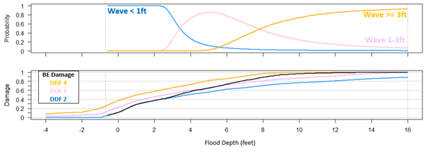
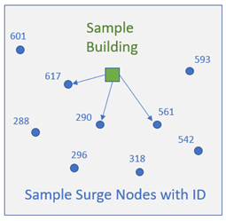

# Coastal Consequences Methodology

## Hazard Data Inputs

The coastal consequence methodology relies on a set of core hazard inputs that collectively describe the coastal flooding conditions relevant to damage and loss estimation at each structure. These inputs include water surface levels, wave heights, and associated uncertainty. While designed to ingest probabilistic coastal hazard datasets such as those from the North Atlantic Coast Comprehensive Study (NACCS) and similar probabilistic storm surge/wave products, the methodology is flexible and can operate with any valid hazard data provided in the required formats. The sections below describe the role, requirements, and assumptions associated with each hazard input.

### Stillwater Elevation Nodal Data (SWEL)

Stillwater elevation represents the baseline coastal water level associated with storm surge and tide, excluding direct wave effects. SWEL is a required hazard input and forms the foundation for flood depth and total water level calculations.

Hazard datasets are expected as point (nodal) estimates of SWEL at multiple annual-chance exceedance levels (e.g., 1-year through 10,000-year). For each structure, SWEL values are transferred from nearby hazard nodes using a spatial nearest-neighbor averaging approach, which computes a weighted mean of the nearest SWEL values for each frequency. SWEL must be provided in consistent vertical units (feet above a common datum) and aligned with structure elevation data.

### SWEL Uncertainty Nodal Data

SWEL uncertainty quantifies the confidence bounds around the best-estimate water level. Probabilistic coastal hazard products typically include an upper confidence limit (e.g., 84th percentile) in addition to the best estimate. The difference between the upper confidence limit and the best estimate is used to approximate a one-standard-deviation uncertainty for SWEL at each frequency.

When uncertainty data are supplied, the methodology propagates this variability into flood depth and total water level uncertainty, which influences damage and loss estimates. If uncertainty is not provided, the model assumes zero uncertainty (deterministic best estimate) for SWEL.

### Controlling Wave Height (Hc) Nodal Data

Wave effects play a critical role in coastal damage processes by contributing to runup, impact forces, and overall structural stress. Controlling wave height (Hc) is the wave metric used in damage estimation and must be supplied for each annual-chance frequency. If input data are provided as significant wave height (Hs), a user must use a conversion factor (e.g., 1.6 × Hs) to approximate controlling wave height as a preprocessing step, prior to ingestion into the Consequences Solution.

Similar to SWEL, wave height values are spatially transferred to structures using a nearest-neighbor averaging scheme. Controlling wave height inputs is essential for differentiating wave exposure regimes in the damage function assignment.

### Wave Height Uncertainty (He) Nodal Data

Wave height uncertainty quantifies variability in the estimated wave conditions and is typically derived from confidence limit datasets accompanying the best-estimate wave heights. As with SWEL uncertainty, the difference between the upper confidence limit and the best estimate for wave height is used to approximate a one-standard-deviation uncertainty term.

This uncertainty is propagated in coastal damage calculations by probabilistically blending depth-damage functions from multiple wave regimes based on the likelihood of different wave height intervals at a given event. For example, if wave height uncertainty indicates a 40% chance of falling within the range of V-Zone damage functions (> 3 feet) and 60% chance of A-Zone (>1 to 3 feet), the DDFs are weighted accordingly.

## Depth-Damage Function Assignment

Structural damage is estimated using coastal-specific depth-damage functions (DDFs) that relate flood depth above the first floor to percent damage. Damage is evaluated over a continuous range of building flood depths (BFDs) from -4 to +16 feet relative to the first-floor elevation (depth in-structure), consistent with the domain of the underlying DDFs.

For each building, a family of four depth damage functions are chosen based on the building foundation type, number of stories, and basement finish type. Each of the four damage functions represents a different environmental scenario:

- **DF1: freshwater inundation**

  Although DF1, representing freshwater inundation, is defined for each family of building type, it is not used by this tool to calculate building damage and loss.

- **DF2: saltwater inundation with waves less than 1 feet**

- **DF3: saltwater inundation with waves less than or equal to 1 foot and less than 3 feet**

- **DF4: saltwater inundation with waves greater than or equal to 3 feet**

The Coastal Consequences Methodology uses a probabilistic blending approach to combine the three wave-specific damage curves (DF2, DF3, DF4) into a single composite damage curve for each structure. At each building flood depth (BFD), the probability of realizing wave conditions in each wave category is computed using a normal cumulative distribution function (CDF), where the mean is equal to the controlling wave height (Hc) and the standard deviation is equal to the wave height uncertainty (He):

- **Probability of waves < 1 ft** = CDF evaluated at 1 ft
- **Probability of waves ≥ 3 ft** = 1 − CDF evaluated at 3 ft
- **Probability of waves ≥ 1 ft and < 3 ft** = remainder probability

These probabilities are used as weights to combine the three wave-dependent damage curves at each flood depth. The resulting composite damage value is calculated as:

<!-- mdformat off -->

$$
D =
\\left(D\_{3p} \\cdot P\_{3p}\\right) +
\\left(D\_{1\\text{-}3} \\cdot P\_{1\\text{-}3}\\right) +
\\left(D\_{\\mathrm{lt1}} \\cdot P\_{\\mathrm{lt1}}\\right)
$$

<!-- mdformat on -->

**Where:**

<!-- mdformat off -->

- $D$ = composite percent damage at a given building flood depth
- $D\_{3p}$ = percent damage from the $\\ge 3$ ft wave depth–damage function
- $D\_{1\\text{-}3}$ = percent damage from the 1–3 ft wave depth–damage function
- $D\_{\\mathrm{lt1}}$ = percent damage from the $\<1$ ft wave depth–damage function
- $P\_{3p}$ = probability of $\\ge 3$ ft wave conditions
- $P\_{1\\text{-}3}$ = probability of 1–3 ft wave conditions
- $P\_{\\mathrm{lt1}}$ = probability of $\<1$ ft wave conditions

<!-- mdformat on -->

This process produces a single, depth-dependent damage curve that reflects both flood depth and uncertainty in wave conditions.

*Figure 1. Example of a building wave height probabilities (Top) and resultant combined damage function (Bottom).*

## Loss Calculations

The coastal consequence methodology calculates building losses by combining hazard inputs, depth-damage functions, and probabilistic event sampling. It translates hazard conditions (stillwater elevation and wave height) into building flood depths, applies the composite DDFs to estimate damage, and integrates across event probabilities to produce annualized loss estimates. The subsections below describe each step.

### Determining Depth at Structure

Determining flood depth at a structure involves transferring coastal hazard information to each building and converting those hazard conditions into depth relative to the building’s first floor. The primary coastal hazard inputs are stillwater elevation (SWEL) and controlling wave height, which are provided at discrete hazard node locations across a range of annual-chance frequencies.

To associate these hazard values with individual structures, a nearest-neighbor spatial approach is applied, as illustrated in Figure 2. For each building, the three nearest SWEL nodes are identified, and their values are averaged to assign a mean stillwater elevation at each frequency. An identical process is applied independently to controlling wave height nodes, resulting in a mean wave height value for each structure at each frequency. Uncertainty values for both SWEL and wave height are derived from corresponding confidence-limit datasets and are carried forward for use in damage and loss calculations. Note that user interviews indicated a desire to modify this method by weighting the proximity of the nearest neighbor. Future updates may modify the existing approach where the 3 nearest values all have equal weight.

*Figure 2. Map of Example Building and Node locations.*

### Determining Depth in Structure (Building Flood Depth)

For each structure and annual-chance frequency, the assigned stillwater elevation and wave contribution are combined to derive the Total Water Level (TWL) at the structure. TWL represents the water surface elevation required to produce a given level of inundation and serves as the linkage between coastal hazard inputs and building-level flood depth. The building flood depth (BFD) is then calculated as the difference between the total water level and the structure’s first-floor elevation (FFE). BFD represents the depth of water relative to the first floor (depth in-structure) and is the independent variable used in the application of depth-damage functions.

The assigned TWL values across annual-chance frequencies define a building-specific flood frequency curve, which relates water level to annual exceedance probability. For each value of building flood depth, the TWL required to produce that depth is identified using the structure’s first-floor elevation, and the corresponding event probability—or recurrence interval—is extracted from the flood frequency curve. At this stage, the associated hazard attributes, including stillwater elevation, wave height, and their respective uncertainty terms, are transferred to the flood-depth-based calculation table. This process establishes a consistent relationship between flood depth at the structure, the probability of the event producing that depth, and the uncertainty associated with the underlying hazard inputs.

#### Total Water Level Uncertainty

Uncertainty in total water level reflects uncertainty in both surge and wave conditions. These uncertainty components are assumed to be independent and are combined using a root-sum-of-squares formulation.

The uncertainty associated with total water level (TWLe) is calculated by combining the uncertainty in stillwater elevation (SWELe) and the uncertainty in controlling wave height (He), with a scaling factor applied to account for the conversion from controlling wave height to an equivalent breaking wave contribution consistent with the damage function formulation:

<!-- mdformat off -->

$$
\\mathrm{TWLe} = \\sqrt{(\\mathrm{SWELe})^2 + (0.7 \\cdot \\mathrm{He})^2}
$$

<!-- mdformat on -->

The coefficient of 0.7 represents the conversion from controlling wave height to breaking wave height used in coastal damage estimation.

#### Flood Depth Uncertainty at the Structure

Flood depth uncertainty represents variability in the estimated depth of inundation relative to the structure’s first floor. This uncertainty arises from two independent sources—uncertainty in total water level and uncertainty in first-floor elevation.

Flood depth uncertainty (BFDe) is calculated by combining these components using a root-sum-of-squares approach:

<!-- mdformat off -->

$$
\\mathrm{BFDe} = \\sqrt{(\\mathrm{FFEe})^2 + (\\mathrm{TWLe})^2}
$$

<!-- mdformat on -->

where FFEe represents uncertainty in first-floor elevation and TWLe represents uncertainty in total water level.

Flood depth uncertainty is propagated into damage calculations by evaluating depth-damage functions at flood depths offset by plus and minus one standard deviation. This approach produces low-, best-, and high-estimate damage and loss values while preserving the nonlinear relationship between flood depth and structural damage.

### Applying the Depth-Damage Function

Once the building flood depth relative to the first floor has been determined for each structure, the depth-damage functions are applied to estimate structural damage. Damage is evaluated using the composite depth-damage function developed for the structure, which integrates building attributes and probabilistic wave effects.

For each flood depth, the composite depth-damage function is evaluated to estimate the percent of building damage associated with that level of inundation. To account for uncertainty in flood depth, damage is not evaluated at a single depth alone. Instead, three damage estimates are produced using the same composite damage function evaluated at different depth conditions.

The best-estimate damage corresponds to the composite depth-damage function evaluated at the mean building flood depth. The low-estimate damage is obtained by evaluating the damage function at a flood depth reduced by one standard deviation of flood depth uncertainty, while the high-estimate damage is obtained by evaluating the same damage function at a flood depth increased by one standard deviation. This approach propagates flood depth uncertainty through the damage calculation while preserving the nonlinear relationship between depth and structural damage.

*Figure 3. Example of deriving a low, best- and high-estimate of damage using the combined damage curve and a single value of BFD and associated BFD error.*

Percent damage values are then converted to monetary losses by multiplying the estimated damage percentage by the structure’s replacement value. Losses are constrained to physically plausible conditions—structures that experience negligible inundation or remain effectively dry under a given event are assigned zero loss. These loss estimates are carried forward for probabilistic sampling and average annualized loss calculations.

### Generating Probabilistic Events and Storm Elevations

To capture the full range of possible events contributing to loss, the methodology uses Monte Carlo sampling to generate a probabilistic set of event probabilities. A user-defined number of random probabilities are sampled between 0.0001 and 1.0. Each probability is mapped to corresponding SWEL and wave values and then to a flood depth and damage estimate. This procedure enables characterization of low-probability, high-impact events that contribute significantly to annualized loss.

Alternatively, a suite of predefined storm magnitudes may be used to ensure consistency across analyses.

### Calculating Average Annualized Loss

Average Annualized Loss (AAL) represents the long-term expected annual loss at a structure and is calculated by integrating event losses across the full range of event probabilities. To compute AAL, the low-, best-, and high-estimate losses corresponding to each of the N probabilistic storm events are first paired with their associated event probabilities. These loss–probability pairs are then sorted in descending order of probability to ensure consistent numerical integration across return periods.

AAL is calculated by numerically integrating the loss–frequency relationship using a trapezoidal approximation. For each adjacent pair of probabilistic events, the average loss between the two events is weighted by the difference in their return periods. This approach captures the contribution of both frequent, low-loss events and rare, high-loss events to the long-term expected annual loss.

The structure-level AAL is calculated as:

<!-- mdformat off -->

# $$ \\mathrm{AAL}

\\sum\_{i=1}^{n-1}
\\left\[
(F_i - F\_{i+1}) \\cdot \\frac{L_i + L\_{i+1}}{2}
\\right\]

- (F_n \\cdot L_n)
  $$

**Where:**

- $n = N$, the total number of probabilistic events
- $F_i = \\dfrac{1}{\\text{ith Probability}}$, the return period associated with event $i$
- $L_i$ = loss associated with event $i$

<!-- mdformat on -->

This calculation is performed independently for the low-, best-, and high-estimate loss curves, resulting in three AAL values for each structure—a minimum estimate, a best estimate, and a maximum estimate. These values characterize the expected annual loss while explicitly accounting for uncertainty in hazard intensity, flood depth, and damage response.

## Results

The existing tool provides a range of results output including a results, prep, wave height and water surface shapefile of each building point. In addition, there is a TAB folder containing a .csv for each building analyzed, a run log file and a .tif heat map.

### Results Shapefile

A shapefile of all building points with the fields described below:

| Field Name | Description | Data Type |
|----------|-------------|-----------|
| FID | Sequential numeric ID starts at 0 | Object ID |
| Shape | Point geometry | Geometry |
| BID | Sequential numeric ID starts at 1 | Long |
| ORIG_ID | Original NSI and Milliman ID | Text |
| BLDG_DED | Building Deductible ($1,500 default) | Double |
| BLDG_LIM | Building Limit ($200,000 default) | Double |
| BLDG_VAL | Building Value (USD) | Double |
| CNT_DED | Content Deductible ($1,000 default) | Double |
| CNT_LIM | Content Limit ($100,000 default) | Double |
| CNT_VALUE | Content Value (USD) | Double |
| STORY | Number of stories | Double |
| FOUND | Foundation type (2–9) | Double |
| BASEFIN | Basement Finish Flag (0 or 1) | Double |
| FFH | First floor height (feet) | Double |
| DEMFT | Ground surface elevation (feet) | Double |
| ANLYS | Analysis flag (0=no results, 1=included in analysis) | Double |
| BAAL | Building AAL "Best Estimate" (USD) | Double |
| BAALmin | Building minimum AAL (USD) | Double |
| BAALmax | Building maximum AAL (USD) | Double |
| FLAG_DF16 | Damage function flag (0 or 1) | Double |

### WSE Shapefile

This shapefile contains the water surface elevation and uncertainty value in feet for each return period available at each building point. Fields are also available with the three nearest surge node IDs. A Valid field with a 0 or 1 where 0 is to be excluded from analysis due to having a 95% chance of the DEMFT above the flood elevation of the max event; 1 otherwise.

### WAV Shapefile

This shapefile contains the wave height and uncertainty value in feet for each return period available at each building point. Fields are also available with the three nearest surge node IDs. A Valid field with a 0 or 1 flag is provided that is currently unused.

### PREP Shapefile

This shapefile contains both the WSE and WAV data, as well as four DDFs IDs representing riverine, saltwater, coastal A and V. A DDF ID for erosion is currently unused. A summary of the inventory attributes is also included.

### Heatmap

A .tif grid with a resolution of ~200 meters is created with symbology that provides the total AAL in each grid cell.

### Run Logfile

Processing notes and runtime messages are printed to both the screen and to a text file. A text file that describes the input and output locations, the parallel processing and each major analysis step including validation messages. The text file is named `[x]_run.log`, and is found in the output directory.

### Building .csvs

A TAB folder contains a .csv for each building analyzed with detailed information if the user chooses. It includes the SWEL and WSE, the DDF probability weighting, the DDF IDs used with the damage percent and losses for the low, best and high hazard values for all return periods. These are provided for all buildings, regardless of exposure to flooding or impacts.

Each loss table is a 202 row × 32 column table (including header row) that will contain the various necessary calculated values to derive building loss at each value of building flood depth from -4 feet to +16 feet by increments of 0.1 feet. The attributes of the table are described below:

| FIELD | Sample VALUE | DESC |
|------|--------------|------|
| BID | 1234 | Unique integer building ID generated by code |
| BFD | -1.9 | Depth of flood above first floor |
| DEM | 10.696 | Elevation from DEM in feet, NAVD88 |
| FFE | 11.696 | First Floor Elevation in feet, NAVD88 |
| FFEe | 0 | Error associated with FFE |
| TWL | 9.796 | Total Water Elevation in feet, NAVD88 |
| TWLe | 1.603 | Error associated with TWL |
| BFDe | 1.603 | Error associated with BFD |
| RP | 138.168 | Return Period |
| PVAL | 0.007237566 | Probability (1/RP) |
| SWEL | 9.795997218 | SWEL in feet, NAVD88 |
| SWELe | 1.60332847 | Error associated with SWEL |
| WET | 0.287238001 | Probability that ground at building is flooded |
| Hc | 0 | Conditional wave height in feet |
| Hce | 0 | Error associated with Hc |
| PWL1 | 1 | Probability of waves less than 1 foot |
| PW13 | 0 | Probability of waves between 1 and 3 feet |
| PWG3 | 0 | Probability of waves greater than 3 feet |
| DDFfam | 2400 | Building's Coastal FFRD Depth-damage function family |
| dfx1 | 0 | Damage from DDFx1 (%) |
| dfx2 | 0.015 | Damage from DDFx2 (%) |
| dfx3 | 0.031 | Damage from DDFx3 (%) |
| DAMLw | 0 | Low Estimate Damage (%) |
| DAMPr | 0 | BE Combined Damage (%) |
| DAMUp | 0.05624 | High Estimate Damage (%) |
| BVAL | 1008431 | Building replacement value ($) |
| rLOSSLw | 0 | Raw Low Building Loss ($) |
| rLOSSBE | 0 | Raw BE Building Loss ($) |
| rLOSSUp | 56714 | Raw High Building Loss ($) |
| Loss_Lw | 0 | Final Low Building Loss ($) |
| Loss_BE | 0 | Final BE Building Loss ($) |
| Loss_Up | 56714 | Final High Building Loss ($) |

Based on integration with the inland consequences framework, future development is likely to include a notebook interface where the user can highlight and select desired outputs and file types.
