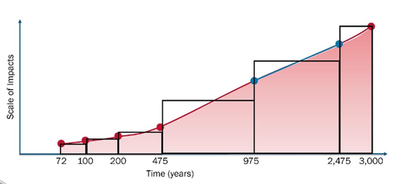

# Inland Consquences Methodology

______________________________________________________________________

## Hazard Data Inputs

The inland consequence methodology relies on a set of core hazard layers that describe the depth (required), uncertainty (optional), velocity (optional), and duration (optional) of flooding at each location. These inputs collectively guide the selection of the appropriate depth-damage functions and determine the damage to the structure associated cost. While the methodology is designed for FEMA’s Future Flood Risk Data (FFRD) post-processed annual exceedance probably (AEP) flood depth rasters and their associated velocity, duration and uncertainty layers, it is designed to be flexible and can operate with any user-provided hazard data that meets the required formats. The sections below describe the role, requirements, and assumptions associated with each hazard input.

### Flood Depth

Flood depth rasters are the primary hazard input driving the inland consequence calculations and only required hazard input. The methodology is built to ingest FEMA’s post-processed AEP depth rasters for multiple return periods, but it is flexible enough to operate with any valid flood depth raster. Under normal use, the tool expects depth inputs for several AEPs, allowing annualized losses to be computed from a consistent hazard set. Users may modify the number of AEPs depending on the data available, however a minimum of three return periods is required to calculate average annualized loss. Depth values must be provided in units of feet.

The tool can also run in single-event mode by ingesting a single depth raster representing a historical or design event; in this configuration, the tool produces an event-specific loss rather than an annualized estimate.

At this time, the methodology does not ingest the full suite of FFRD Monte Carlo simulation rasters to compute annualized losses directly from the simulation ensemble; this capability is identified as a future enhancement.

### Flood Depth Uncertainty

Flood depth uncertainty rasters provide information on the variability of the predicted flood depth for each AEP. When supplied, these uncertainty layers allow the methodology to explore loss sensitivity and characterize uncertainty more explicitly within the loss calculation process. One uncertainty raster is expected per AEP return period, and the units mirror those of the depth rasters (feet). Although optional, these layers are recommended for users who want to evaluate the robustness of loss estimates or conduct probabilistic analyses. When uncertainty rasters are not provided, the methodology proceeds deterministically using the best-estimate depth values only.

### Flood Velocity

Velocity data support the classification of flood hazard peril and influence the selection of the appropriate depth-damage functions. When a velocity raster is provided, the methodology evaluates each structure’s exposure to high-velocity flow conditions. Velocities exceeding 5 feet per second are treated as high-velocity flooding and may result in the application of different or more severe DDFs. Values below this threshold are classified as low-velocity conditions. If a velocity raster is not supplied, the methodology defaults to assuming low-velocity flooding for all structures. More detail on how velocity interacts with DDF selection is provided in the *Flood Hazard Peril* section.

### Flood Duration

Flood duration rasters are used to determine whether structures are exposed to long-duration inundation, which can significantly affect building performance and loss outcomes. Duration values must be provided in hours, with exposures greater than 72 hours classified as long-duration flooding. This classification may influence which depth-damage functions are applied. When no duration raster is provided, the methodology assumes short-duration flooding for all structures. As with velocity, duration-based peril classification is further discussed in the *Flood Hazard Peril* section.

### File Types

Hazard data is compatible with existing file export formats such as GeoTIFFs and TIFFs, consistent with previous consequence solutions like the Hazus Flood Assessment Structure Tool (FAST) and early FFRD pilot outputs. However, because the final FFRD datasets and file formats are still being defined, additional support has also been implemented for cloud-optimized formats, including Zarr and Xarray-based readers.

______________________________________________________________________

## Depth-Damage Function (DDF) Assignment

The inland consequence methodology assigns depth-damage functions (DDFs) by integrating key building and hazard characteristics: general building type, occupancy type, square footage, number of stories, foundation type, and flood hazard peril type. These elements collectively determine how a structure is expected to perform under various flooding conditions and which DDF function should be applied to calculate percent damage at a given depth in structure. The methodology follows the principles and thresholds developed through the OpenHazus initiative and is designed to maintain alignment with FEMA’s broader approach to flood consequence modeling.

### General Building Type

The general building type describes a building’s construction type and the primary materials used in its construction and is a key factor in understanding how the building responds to flood events. Flood general building types include wood (W), masonry (M), concrete (C), steel (S), and manufactured housing (MH). If the flood general building type is unknown, wood is assumed by default.

### Occupancy Type

Occupancy type is a primary input used to select appropriate DDFs by grouping structures with similar use and vulnerability characteristics. The assigned occupancy type informs both the structure and contents damage relationships applied during flood loss estimation. The occupancy types used in this methodology are listed in Table 1. If the occupancy type is unknown, RES1 is assumed by default.

**Table 1. Occupancy Types**

| Occupancy Type | Description |
|---------------|-------------|
| RES1 | Single-family Dwelling |
| RES2 | Mobile Home |
| RES3A | Multi-Family Dwelling - Duplex |
| RES3B | Multi-Family Dwelling - 3-4 Units |
| RES3C | Multi-Family Dwelling - 5-9 Units |
| RES3D | Multi-Family Dwelling - 10-19 Units |
| RES3E | Multi-Family Dwelling - 20-49 Units |
| RES3F | Multi-Family Dwelling - 50+ Units |
| RES4 | Temporary Lodging |
| RES5 | Institutional Dormitory |
| RES6 | Nursing Home |
| COM1 | Retail Trade |
| COM2 | Wholesale Trade |
| COM3 | Personal and Repair Services |
| COM4 | Business / Professional / Technical Services |
| COM5 | Depository Institutions (Banks) |
| COM6 | Hospital |
| COM7 | Medical Office / Clinic |
| COM8 | Entertainment and Recreation |
| COM9 | Theaters |
| COM10 | Parking |
| IND1 | Heavy Industrial |
| IND2 | Light Industrial |
| IND3 | Food, Drugs, and Chemicals |
| IND4 | Metals and Minerals Processing |
| IND5 | High Technology |
| IND6 | Construction |
| AGR1 | Agriculture |
| REL1 | Church / Non-Profit |
| GOV1 | General Services |
| GOV2 | Emergency Response |
| EDU1 | Schools and Libraries |
| EDU2 | Colleges and Universities |

#### Square Footage

For selected occupancy types and general building type combinations, additional refinement of DDF selection is applied based on building area. For COM1, COM2, IND1-6 and AGR1 occupancies where the general building type is steel, structures with an area less than 4,000 square feet are treated as pre-engineered construction, while structures greater than 4,000 square feet are treated as engineered construction. This classification affects the DDFs applied to both structure and contents losses.

### Number of Stories

The inland consequences methodology uses the explicit number of stories attribute rather than generic low-, mid-, or high-rise categories. This approach allows the methodology to leverage depth-damage functions developed specifically for one-, two-, and three-story structures, which represent the majority of the building stock.

For each combination of general building type, occupancy type, and square footage, an expected minimum and maximum number of stories is defined based on typical real-world construction practices. If an input number of stories exceeds the expected maximum for a given attribute combination, the structure is flagged as a potential anomaly and assigned the maximum allowable number of stories for that combination when selecting the most appropriate DDF. This flag may be used by analysts to identify and evaluate potential issues in the input dataset. Table 2 shows the expected number of stories for attribute combinations.

**Table 2. Expected Number of Stories for Attribute Combination**

| General Building Type | Occupancy Type | Square Footage | Expected Number of Stories |
|----------------------|----------------|----------------|----------------------------|
| Wood | RES1, RES3A | All | 1-4 |
| Wood | RES3B-F, RES4-6 | All | 1-4 |
| Wood | COM1, COM9 | All | 1-2 |
| Wood | COM1, COM9 | All | 3-6 |
| Wood | COM2-8, COM10, IND1-6, REL1, AGR1, GOV1-2, EDU1-2 | All | 1-6 |
| Masonry | RES1, RES3A | All | 1-7 |
| Masonry | RES3B | All | 1-7 |
| Masonry | COM1, COM9 | All | 1-2 |
| Masonry | IND1, AGR1 | All | 1 |
| Masonry | RES3C-F, RES4-6 | All | 1-30 |
| Masonry | COM1, COM9 | All | 3-30 |
| Masonry | IND1, AGR1 | All | 2-30 |
| Masonry | COM2-8, COM10, IND2-6, REL1, GOV1-2, EDU1-2 | All | 1-30 |
| Concrete | RES1, RES3A | All | 1-40 |
| Concrete | RES3B-F, RES4-6 | All | 1-40 |
| Concrete | COM1-10, IND1-6, REL1, AGR1, GOV1-2, EDU1-2 | All | 1-40 |
| Steel | COM1-2, IND1-6, AGR1 | \<= 4,000 sf | 1 |
| Steel | RES1, RES3A-F, RES4-6 | All | 1-108 |
| Steel | COM1-2, IND1-6, AGR1 | > 4,000 sf | 1-108 |
| Steel | COM3-10, REL1, GOV1-2, EDU1-2 | All | 1-108 |
| Manufactured Home | RES2 | All | 1 |

If the number of stories attribute is not provided, the methodology assumes a default of one story.

### Foundation Type

Foundation type is a key structural attribute that influences how buildings respond to flooding and, in cases where foundation information is missing, helps determine the default flood condition applied during loss calculation. The methodology classifies foundations into four categories: Basement, Shallow, Slab, and Pile. Each foundation type is associated with an expected default foundation height when height information is not available in the structure inventory, Table 1.

**Table 3. Inland Foundation Types and Default Foundation Heights**

| Foundation Type | Default Foundation Height |
|-----------------|---------------------------|
| Basement | 2 ft |
| Pile | 8 ft |
| Shallow | 3 ft |
| Slab | 1 ft |

Based on NSI 2025 pre-release materials, an adjustment was made to the default basement foundation heights from 4 ft to 2 ft for alignment.

The consequence methodology is designed to natively support the NSI 2022 Public Version, NSI 2022 Private Version, and Milliman Market Basket datasets. For additional details on how foundation types are defined and derived within these inventories, refer to the [**Building Inventories Technical Implementation Documentation**](building_inventories.md).

### Hazard Peril

Hazard peril describes the specific flood conditions a structure is exposed to and is a critical determinant of how damage progresses during an event. Different flood processes—such as long-duration inundation or high-velocity flow—impose distinct physical stresses on buildings, and selecting the correct peril ensures that the depth-damage function accurately reflects those conditions.

For inland (riverine) flooding, the methodology classifies hazard peril based on duration and velocity. Long-duration flooding is defined as inundation lasting 72 hours or more, consistent with thresholds used in USACE’s GoConsequences model. When duration data are unavailable, flooding is treated as short duration. Flow velocity is then evaluated to distinguish between low- and high-velocity conditions. High-velocity flooding is defined as flow ≥ 5 ft/s; values below this threshold are considered low velocity. If velocity data are not available, the methodology defaults to low-velocity conditions.

Each structure is assigned a single riverine flood peril based on the combination of duration and velocity characteristics. The riverine peril types used in this methodology are shown in Table 3.

**Table 4. Riverine Flood Peril Descriptions**

| Flood Peril | Description |
|-------------|-------------|
| RLS | Riverine, Low Velocity, Short Duration |
| RHS | Riverine, High Velocity, Short Duration |
| RLL | Riverine, Low Velocity, Long Duration |
| RHL | Riverine, High Velocity, Long Duration |

### DDF Assignment

Based on general building type, occupancy type, square footage, number of stories, foundation type, and hazard peril, the methodology integrates these inputs to select the appropriate depth-damage function. This is performed through a dedicated DDF assignment module that applies a sequence of lookup tables consistent with OpenHazus conventions. The assigned DDF determines the percent damage at each depth and forms the basis for structure- and content-level loss calculations. For more details on the DDF assignment look up tables please refer to the technical implementation documentation.

This workflow is actively advancing under the OpenHazus innovation account and the Natural Hazard Risk Assessment Program, and the modular design ensures the system can incorporate future modifications, including new building classifications, updated peril logic, probabilistic DDF selection, or integration with enhanced hazard datasets. The result is a flexible, transparent, and extensible framework for assigning depth-damage functions within the inland consequence methodology.

______________________________________________________________________

## Loss Calculations

The inland consequence methodology calculates flood losses by combining structure-level attributes, hazard inputs, and depth-damage functions (DDFs) to estimate expected damages to buildings, contents, and inventory. The process begins by determining the flood depth at each structure and proceeds through percent-damage estimation, loss calculation, and annualization across all modeled return periods.

### Determining Depth in Structure

Loss calculations begin by spatially intersecting each structure with the flood depth raster to determine the depth at the structure location. Structures with 0 or negative depths at structure will not have losses calculated as these represent dry structures. The methodology then subtracts the foundation height from this value to compute the depth in structure, which represents the depth of water relative to the occupied or finished interior of the building. For some foundation negative depths in structure will result in losses, such as finished basement where you would see damage below the first-floor.

### Applying Depth-Damage Functions

Each building component (structure, contents, and inventory) has its own DDF ID and corresponding depth-damage curve. After we determine the water depth inside the structure, we use each DDF ID to look up the expected percent damage for that component. Depth-damage curves report damage at fixed depth intervals (for example, every 0.5 or 1 foot). To estimate damage at the exact water depth, the methodology interpolates between the curve’s points, producing a smooth, continuous estimate. The result is three separate percent-damage values—one each for structure, contents, and inventory—representing how much of each component is expected to be lost at that water depth.

The monetary loss for each component (structure, content and inventory) is calculated by multiplying the percent damage by its corresponding valuation amount (structure valuation, content valuation and inventory valuation).

This process is followed for each return period to produce estimated losses for each return period included in the hazard dataset. For single return periods events, results are provided after this loss calculation. For multiple return periods events, an average annualized loss is calculated.

### Average Annualized Loss (AAL)

After losses are computed across all available return periods, the inland consequence methodology derives the Average Annualized Loss (AAL), which represents the long-term expected loss per year. The AAL is calculated using a Riemann sum numerical integration approach, consistent with the methodology employed in FEMA’s Hazus Program. Table 5 illustrates this method, in which the inland consequence solution computes annual losses for eight probabilistic return periods (RPs). The annual probability of each event is calculated as 1/RP, and differential probabilities are obtained by subtracting adjacent annual occurrence probabilities based on descending order (e.g., 2,000 year – 1,000 year annual probability).

The average loss for each interval is then calculated by averaging the annual losses associated with the corresponding return periods, as shown in the “average losses” column. The AAL is obtained by summing the products of each average loss and its associated differential probability, resulting in a single annualized estimate of expected flood-related losses.

In this approach, each pair of return-period losses and their associated frequencies is treated as a point along a continuous loss-exceedance curve. As illustrated in Figure 1, by summing up the areas of rectangles or trapezoids formed between adjacent points, the Riemann sum integrates across the full range of flood frequencies to produce the annualized loss. Two options are available for the annualization of losses for the first high frequency return period where no losses occur. The first method is to average the 0 loss with the next highest loss, which is the common default method in Hazus and the second is to truncate the lowest range. The Table 5 example below illustrates the default (non-truncate) method for an industrial building in the Duwamish watershed that is impacted by 500 year and longer return period flooding and dry at 200 year and less. This is a IND5 structure with a building value of $12,156,928. In the truncate method, the 200 year contribution to AAL is reduced by $2,912 (nearly 40% of AAL). Both options are available, and the large difference can be mitigated by using a larger number of frequencies.

**Table 5. Average Annualized Building Loss Estimations**

| Return Period | Annualized Probability | Differential Probability | Scenario Losses ($) | Average Loss Formula | Average Losses ($) | Annualized Losses ($) |
|--------------|------------------------|--------------------------|---------------------|----------------------|--------------------|-----------------------|
| 2000 | 0.00050000 | 0.00050000 | 2,966,772 | L2000 | 2,966,772 | 1,483 |
| 1000 | 0.00100000 | 0.00050000 | 2,549,166 | (L2000 + L1000) / 2 | 2,757,969 | 1,379 |
| 500 | 0.00200000 | 0.00100000 | 1,941,000 | (L1000 + L500) / 2 | 2,245,083 | 2,245 |
| 200 | 0.00500000 | 0.00300000 | 0 | (L500 + L200) / 2 | 970,500 | 2,912 |
| 100 | 0.01000000 | 0.00500000 | 0 | (L200 + L100) / 2 | | |
| 50 | 0.02000000 | 0.01000000 | 0 | (L100 + L50) / 2 | | |
| 20 | 0.05000000 | 0.03000000 | 0 | (L50 + L20) / 2 | | |
| 10 | 0.10000000 | 0.05000000 | 0 | (L20 + L10) / 2 | | |
| **Total** | | | | | | **8,018.95** |

**Figure 1 Illustration of Estimating Area of Loss Curve Based on Input Return periods Using Riemann Sums Method**

A greater number and wider range of modeled return periods yield a more complete and representative loss curve. A minimum of three return periods is required to compute AAL, though including additional frequencies improves accuracy. Contractor research indicates that using approximately 22 return periods offers an effective balance, capturing the loss curve with high fidelity while minimizing computational demands. However, decisions for FFRD pertaining to the recommended number of return periods are pending.

**Figure 2 PTS Contractor Research on the Recommendation for Identifying 22 return periods to represent the full Annual Exceedance Probability Curve**

______________________________________________________________________

## Uncertainty

Three major sources of uncertainty are considered:

1. Hazard
1. Building data and attribution
1. Depth-Damage Functions (DDFs)

Initially, the tool will provide uncertainty based on hazard and placeholders for methods to incorporate uncertainty based on building data and DDFs, as well as a combined uncertainty across all sources.

FFRD input provides hazard-related uncertainty; however, an ongoing OpenHazus Innovations task is intended to refine and develop recommendations for building data, DDF and combined uncertainties.

FFRD uncertainty represents the standard deviation of the hazard for a given frequency across 50 realizations for each of the return periods available. The deviation is provided in feet related to the mean flood depth and feet per second relative to the mean velocity. When these uncertainty grids are available, losses will include the minimum, mean and maximum based on mean and standard deviation. Cases where large uncertainties for long return periods result in minimum losses lower than more frequent return periods at the structure level will be flagged (e.g. 1,000 year > 2,000 year).

Several OpenHazus tasks are scheduled for completion in March 2026 to evaluate and provide recommendations for uncertainty-related processes, including:

- Uncertainties including internal inconsistencies in % loss for each stage depth based on examples from DDF’s outlined in the uncertainty white paper and from DDFs with available uncertainties (e.g. IWR, NAACs, and FEMA claims data studies).
- Outline the process flow for evaluating the DDF uncertainty impacts on losses. Capture assumptions and carry uncertainty through to outputs, including median losses, ranges, and probabilities.
- Outline how other building foundation types and height attributes are incorporated into the OpenHazus uncertainty process, including processes that consider uncertainties in occupancy, square footage, number of stories, basement/finished and value.
- Setup a global sensitivity analysis experimental design for total losses. Consider certain known parameters like water depth, velocity, building occupancy, foundation type, FFE, and DDF uncertainty.
- Complete global sensitivity analysis for pilot FFRD data.

## Results

Results are provided at the structure level using a Python notebook interface. The notebook supports:

- A final summary table of AAL building and content losses, providing mean, minimum, and maximum values when uncertainty is available.

- A final summary table of actuarially adjusted AAL building, content, and inventory losses that accounts for limits and deductibles and provides mean, minimum, and maximum values when uncertainty is available.

- A comprehensive results table that allows users to select outputs in a variety of user-defined formats (e.g., `.csv`, file geodatabase, parquet). This table includes all return period and event-level building, content, and inventory losses based on mean values and available uncertainties; mean and standard deviation of flood depths at the structure and in-structure based on foundation height; damage function IDs and percent damage for structure, content, and inventory along with the corresponding depth in structure; and inventory attributes such as building and content value, occupancy, foundation type and height, number of stories, building and footprint area, and general building type.

- Summary options that enable aggregation of total losses by occupancy, building type, and foundation type, as well as by geographic areas such as state, county, tract, census block, HUC, and jurisdiction.
